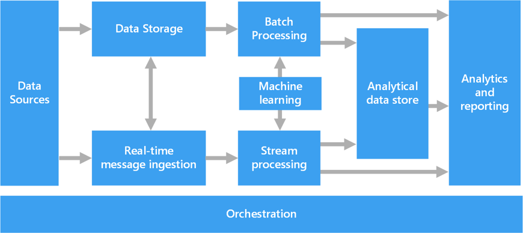

## Technical Diploma

#### Big Data Infrastrucre
 
Data Ops/Data Engineer/Data Architect - design and build data pipelines, creates data pipeline software
- Hadoop, Hive, Kubernetes, Spark, Kafka, NoSQL dbs, SQL
- Strong programming skills
- Linux, networking

Business Intelligence Analyst - builds and maintain data warehouses
- SQL and DW design skills
- Scripting skills (Python, Shell)
- Vendor datawarehousing solutions (Teratada, Oracle, Reshift, BigQuery) skills

ETL Engineer - builds ETL(extract, transform and load) flows
- SQL skills
- Scripting skills (Python, Shell)
- Vendor datawarehousing solutions (Informatica, Talend, Spark) skills

#### Machine Learning

Data Scientist - analyzes data to create predictions and insights
- Strong analytical skills
- Python and ML skills
    
Machine Learning Engineer - creates machine learning software
- Strong programming skills
- Strong mathematical and statistical skills

## Business Diploma

Data Visualization Developer (Reporting Developer) - creates/automates reports and visualizations
- Vendor viz solutions (Tableau, Power BI, Microstrategy) skills
- SQL skills

Business Analytics Specialist - bridges business and data analysis 
- Access, excel, SQL, sharepoint
- Domain knowledge

Too difficult to master all skills, ideally select companies you'd like to work for, find out their tooling (indeed, contact directly) and focus on learning what's needed!

Google for: infographic data science vs data engineer