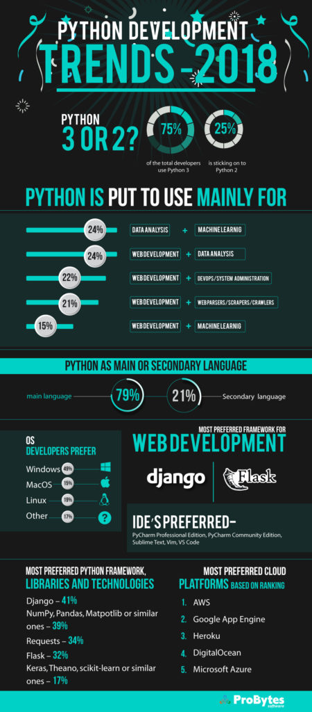
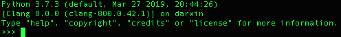

# Reading and Writing Datasets with Python

### Agenda
* Reviewing Python
* The Python Shell
* Writing a Python script
* Reading files
* Writing Files
* Fetching Files in the web and cloud

### Reviewing Python
* Why do I need Python if we can use the shell? Let's debate this for a moment on a few use cases:
  * You need to ingest marketing data from an API to the file system every day at 4AM. This data has to be organized by date and only accessible by authorized staff. 
  * You're designing a new data pipeline and report. You're the responsible to analyse what're the necessary data fields, how they should be standardized, how they'll be transformed into useful KPI's/Metrics to help management take decisions.
  * Some of the data we recently ingested is crashing the data processing applications. The data is written in json files on the file system and you need to identify what's wrong.   
  * Querying massive amounts of data stored in a distributed NoSQL database, you need to generate Machine Learning models and serve them through an API.

* Python is a programming language created in 1991 with a design Philosophy emphasizing Code Readability
* Due to its simplicity, it's always been largely used for academic purposes, but it really took off around 2011 due to its compatibility with several popular platforms like PySpark and AWS Lambda. 
* A few characteristics from the Python language are:
  * Free and OpenSource: No vendor lock-in and no hidden service fees, making it safe for small and large companies adoption
  * Portable : can be executed without modification on Windows/Linux and MacOS systems
  * Ecosystem and community: Python has one of the largest libraries ecosystems in the IT industry
  * Interpreted: Python doesn't require slow/complex code compilation, facilitating deployment
  * Tools: There are several quality tools developed to assist Python development, like PyCharm and Jupyter

         
   
* [Google Trends](https://trends.google.com/trends/explore?date=all&geo=US&q=%2Fm%2F02p97,%2Fm%2F07sbkfb,%2Fm%2F05z1_,%2Fm%2F0jgqg,%2Fm%2F0_lcrx4) comparing it to other popular languages

* Python code is written in files that we'll call scripts and use the `.py` extension
* Python scripts can be executed with a Python Interpreter, which is already installed in this classroom
* The Python Interpreter can be invoked in two ways:
  * We can invoke the command `python3 <my_script>.py`. Let's run a create a `hello-world.py` example
  * We can use a tool called Python Shell by typing `python3` on the terminal. This will provide us with a special shell capable of running any python commands

### The Python Shell
* Let's take a look at a few Python examples in our code project
* Now let's practice them by starting the python shell in our terminals by typing `python3` and do the following steps together
* On Windows, the python shell is easily accessible through Spyder. Otherwise, to access it through cmd you need to add the Python path to your environment variables. 

        

1. Check what's the data type of the following values:

```
   type(1)
   type(3.14)
   type("Big Data!")` and `type('Big Data!')
   type(True) and type(False)
   type([1,2,"intruder",3])
```

2. Use the command `help(str)`. What does the built-in help() method does?
3. Use the command `dir(str)`. What does the built-in dir() method does?
3. Test the following inputs in Python shell: `'abc'`, `'ABC'`, `'ABC'.lower()` and `help('ABC'.lower())`
4. Write an equation that uses multiplication, subtraction and an addition that is equal to 42.5. 
5. Assign the result to the variable `result`. Ex: `result = <my equation formula>` 
6. Print your variable using `print(result)`
7. Given the string `'big data'` use slicing to produce the string `'g da'`

### Writing a Python script
* Now that you know how to use git clone, clone our course material in a separate directory and open it in a separate PyCharm window for reference.
* Let's now look how to write Python scripts and execute them in our sample project
* A Python script can be written with any text editor, but we'll be using PyCharm, a powerful IDE to assist us
* Let's start by creating a project `python-notebook` in GitHub and cloning it locally using `git clone <my repo url>` in the Terminal
* Let's open PyCharm and familiarize ourselves with the tool:
  * Open the directory you just cloned from GitHub, this will create a project and will make sure you'll be able to push your changes to GitHub later
  * Check the left side menu, top menu, terminal panel and version control panel
  * Create a script that should print any output.
  * There are two ways to run your scripts: type `python3 <myscript>.py` from the Terminal Panel or right click on the script and click `Run`
  
1. In your PyCharm project called `python-notebook`, create a file `python3 testing_scripts.py`, copy the contents below and run it:

```

mynumber=1
myfloat=3.14
mystring='Hello World!'
myboolean=True
mylist=[1,2,3,4,5]

print(mynumber)
print(myfloat)
print(mystring)
print(myboolean)
print(mylist)

print(f'{type(mynumber)}, {type(myfloat)}, {type(mystring)}, {type(myboolean)}, {type(mylist)}')
```

3. Write another script that prints the double of all values between 4 and 8 on the list `[1,2,3,4,5,6,7,8,9]`
4. Write another Python program that separates all values in the list `[1,2,3,4,5,6,7,8,9]` in two other lists. One resulting list should contain all even numbers and the other should contain all odd numbers.
5. A script that prints the integers from 1 to 100. For multiples of three print "Fizz" instead , and for the multiples of five print "Buzz". For numbers which are multiples of both print "FizzBuzz"
6. Add, commit and push these scripts to the `python-notebook` repository in GitHub!

### Reading files 
* Let's now take a look of how to read a file using Python, this will be our first step towards reading datasets
* Let's see a few script examples together

1. In `python-notebook` project do the following exercise:
2. Copy the [boston housing dataset](python-files/housing.data) file in your project
3. Create a script called `my_csv_reader.py`
4. Check if the boston housing dataset file path is really a file. If it is print `I have a file to process`, otherwise print `Boo, no file for me.`
5. Read the boston housing dataset file 
6. Print the dataset line by line
7. Modify this script by printing each line as a list of values. Example:
   The line:
   ```
   abc,cde,efg,1,2,3
   ```
   in the source dataset should become:
   ```
   ['abc','cde','efg','1','2','3']
   ```
8. Add, commit and push this script to the `python-notebook` repository in GitHub!

### Writing Files
* Let's now take a look of how to write a file using Python

1. Write a script capable of reading all the lines of a csv file
2. It should then validate that each line has the same number of values as the header, any lines with a different number of values as the headers should be saved in a separate list
3. Write back to the same directory a "clean" version of the file
4. Write another file containing only the "invalid" lines of the file

### Final notes on Reading and Writing Datasets with Python
* Let's review what we've learned today
* Today we learned three ways to execute Python code: the Python Shell, running scripts with the Python interpreter and running in PyCharm. In the future classes we'll also learn how to use Jupyter notebooks a powerful prototyping tool frequently used for Data Science 
* We've learned Python's basic types and the operations we can use on them
* We've learned how to read and write local files using Python
* We've learned how to retrieve files using Python over the cloud

### Additional Exercises Material
* [Extra exercises](./3-python-exercises.md): Additional exercises to practice each Python topic

### Recommended Readings
* [Software Carpentry Python Lesson](http://swcarpentry.github.io/python-novice-inflammation/index.html): Software Carpentry Lesson on Python basics for data manipulation (Modules)
* [Python Basics Reference](https://pythonbasics.org/): Python basics simplified syntax for using Python basics
* [Python3 Reference](https://docs.python.org/3/library/index.html):  Python3 reference pages containing all base types
* [Python3 for beginners tutorials](https://wiki.python.org/moin/BeginnersGuide/NonProgrammers): Several Python references for studying, all recommended for beginners
* [Python Coding Style Guidelines](https://www.python.org/dev/peps/pep-0008/): Coding style guidelines for Python if you want to make your code look good
* [Troubleshooting for Windows users](https://datatofish.com/add-python-to-windows-path/) who can't use the Python Shell directly from the Windows command: if you want to be able to run Python from the  Windows command line (don't mistake this with the Linux shell), you'll need to add the Python executable to your "path". 

* [Public Apis](https://github.com/public-apis/public-apis): An extensive list of open and free API's for you to practice reading data from APIs

[Back To Main Page](./index.md)
