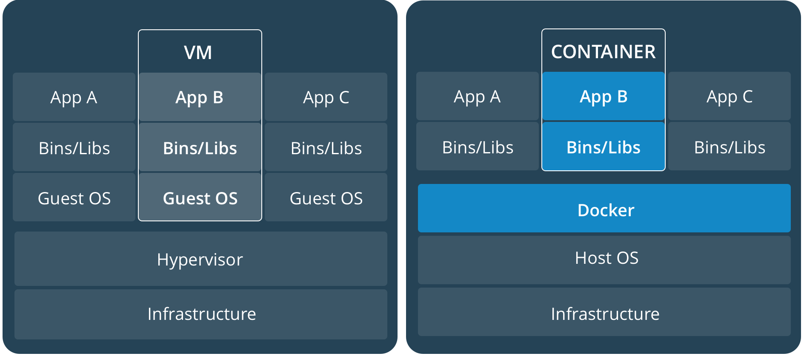

# Intro 2 Containerization & Shipping Software

### Agenda
* Introducing conteinerization
* Images VS Containers: Running Existing Images as Containers
* Creating your own Images and modifying existing Images

### Introducing conteinerization
* Conteinerization has been one of the most important software operations movement in the past 5 years
* Consists of packaging a process and its dependencies, allowing it to run uniformly and consistently on any infrastructure because the process carries its own environment description with it
* A container is a process running in isolation from host os and other containers
* Its a lightweight alternative to traditional virtualization, because it can share the kernel and other layers with the host and other containers

     
     
* Its main goal is to lower friction and costs in migrations that used to be extremely long and costly
  - Mainframes
  - Baremetal Datacenters
  - VMs
  - Cloud
  - Dev, Testing and Production environments (mitigates the infamous "it runs on my machine" problem)
* A container usually will contain code, runtime, system tools, system libraries and settings
* There are short lived and long running Docker processes  
* We can operate docker containers using the docker CLI, let's take a look at the most used commands
* Docker is a platform with multiple parts as we can see below

     

1. Check your `docker version`
2. Check your `docker info`
3. List all possible commands you can do with the docker client.
4. List your currently running containers, check for stopped ones too. It should be empty!
5. Run your first container! Run the official `hello-world` Docker Image. 
6. Read the text that shows up specially the 4 bullet points.
7. List your currently running containers again, check for stopped ones too.
8. Make sure to remove your stopped container.
9. Now start another `hello-world` container using the `--rm` flag. Do you need to remove it after?
10. Is `hello-world` a 'long running' process or a 'short lived' process?

### Creating your own Images and modifying existing Images
* [Dockerfile description](https://docker-curriculum.com/#dockerfile): Basics on writing a Dockerfile
* In order to create our own images we have to add a new file to our project: the Dockerfile. We'll need to use the `docker build` command in order to build an image from a Dockerfile
* We can build upon any existing image, meaning any official image can be extended and customized 

1. Write a small python script that only prints `I'm a short lived python script running within a docker container!!!`. Save it as `short-lived.py`
2. Create a new `Dockerfile` based on the ubuntu linux docker image. This image should always launch your `short-lived.py` script when started. You will need to make sure you install python3 in this image and also to copy your script to the containers.
3. Build this image and run it to test it.
4. Repeat the same steps, but now use a long running process. You can use a `while(True)` loop in  your python script in order to achieve this.
5. Make sure to cleanup by stopping and removing all containers.

### Final notes on Docker

* [Docker Hub](https://hub.docker.com): Docker Hub with tons of images available
* [Docker Trend comparison](https://trends.google.com/trends/explore?date=today%205-y&geo=US&q=docker,big%20data,hadoop,machine%20learning): A trend chard comparing Docker to other important Big Data topics

* ANY process can be Dockerized and the benefits are many:
  - This makes it not only repeatable but self documented, avoiding invalid documentation
  - All teams in company speak one language: containers
  - A process can have multiple Dockerfiles if necessary
* A few real life scenarios where Docker is used:
  - To write software that runs on different computer OS, datacenters, clouds
  - That don't require native libs compatibility
  - To testing apps in different environments at a low cost (OS, DBs, Hadoop, etc)
  - To facilitate CI/CD: automated testing suites, packaging, building and deployment to final environments
* Another advantage of docker containers in the BigData context: shipping data can be expensive, so we ship the applications
* You can find references for many Dockerfiles in the Official Images Docker Library, for example: [Python Docker Image](https://github.com/docker-library/python)
* Conteinerize your final project so that it can be easily executed by on any environment

### Additional Exercises Material
* [Extra exercises](./4-docker-exercises.md): Additional exercises to practice each Docker topic

### Recommended Readings
* [Getting Started with Docker](https://docs.docker.com/get-started/): Official Docker getting started page
* [Docker Workflow overview](https://docs.docker.com/engine/docker-overview/): Diagram showing lifecycle of images and containers
* [Images and Containers](https://docs.docker.com/v17.09/engine/userguide/storagedriver/imagesandcontainers/): The anatomy of images and containers
* [Docker Cheatsheet](https://github.com/wsargent/docker-cheat-sheet): All docker commands and cookbook recipes in a single place!
* [Official docker samples](https://docs.docker.com/samples/): Some Dockerfile samples
* [Official Images Dockerfiles](https://github.com/docker-library/): Images for the Official Docker Images
* [PySpark Jupyter image tutorial](https://medium.com/@suci/running-pyspark-on-jupyter-notebook-with-docker-602b18ac4494): how to run a PySpark Jupyter image in less than 3 minutes
* [Hadoop image](https://hub.docker.com/r/sequenceiq/hadoop-docker/): how to run a hadoop docker container
* [What is Kubernetes](https://kubernetes.io/docs/concepts/overview/what-is-kubernetes/): What is Kubernetes, a high level architecture tool for container orchestration

[Back To Main Page](./index.md)